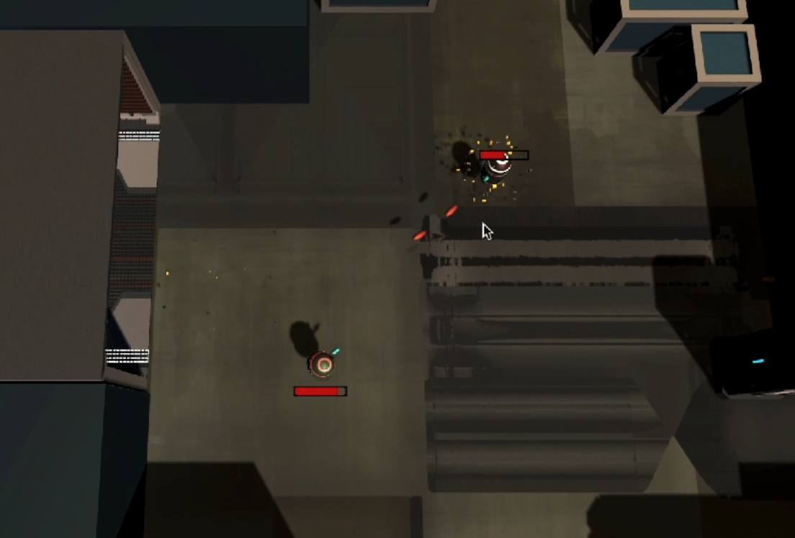

## Team Members
Armand Marino (amarino6@gatech.edu),
Anthony Marshall (amarshall43@gatech.edu),
Ryan Pratt (rpratt6@gatech.edu),
Spencer Shook (sshook8@gatech.edu),
Zachary Hussin (zhussin@gatech.edu)

## Installation
No special installation required, just run the Desentience application file located in the Build folder.

## Running the Game
Three scenes are included in the game "TitleScreen", "DemoLevel", and "AntLevel". The game MUST be run starting with "TitleScreen"; attempting to open the game directly from "DemoLevel" or "AntLevel" will cause the game to be unplayable.

## Gameplay Instructions
Use the WASD keys to move the player up, left, down, and right respectively. Aim with the mouse cursor and press left click to fire.

## Requirements Walkthrough
Our game, Desentience, is a top down shooter that takes place in a 3D world. We utilize rigid body physics with the cubes that are located throughout the map in small clusters, typically stacked on top of each other. These cubes  can be used strategically to block the shots of enemies and pave paths throughout the level. There are health packs located around the map which are represented by a red plus sign that restore half of the player's max health. There's also a keycard, which is located on the desk in a small office room next to an AI agent, that is used in order to reach another part of the level which remains locked off from the player until picked up.

Both programmatic control over animation and an animation controller are used to animate agents. Programmatic control is used to rotate the player away from the direction they're moving, giving the appearence of "leaning" into turns. The animation controller is used on both the player and the mobile enemies to continually play a hovering animation (bobbing up and down), which transitions into a death animation when running out of health. The player has an additional animation layer used to play a shooting animation simultaneously with the hovering animation.

We have three different types of AI agents. There is a turret agent that stays fixed in place and follows the player's movement while shooting, and there's another agent that moves randomly after locking onto the player. Lastly, there is a small chaser-type enemy that charges at the player and initiates a self-destruct to deal damage. An enemy agent is activated after the player enters the agent's detection radius.

On launch, the player will see a title screen which will take the player to the first level. In this level, the player will have to fight two different turret agents or avoid their bullets by either strafing or using the cubes located nearby. 

In the next section, there is a door that remains closed until the player grabs the glowing, rotating keycard that is placed on top of the desk near our other AI agent. Once the keycard is collected, the player will be able to move to the next area. 

There's also a spinning laser beam in one room, and a hidden switch to turn it off that's located in the room surrounded by transparent glass, sitting underneath another enemy AI. 

Towards the end of the level, there are 4 different laser beams that extend straight out alternate between going on and off. 

At the end of the level, right before the player can reach the elevator and see the win screen, there's one last agent standing guard.

The next level provides more gameplay interactions, introducing stationary turrets that cannot be killed as well as a more confined layout compared to the wide-open space of the first level.

## Known Bugs
The pathfinding for the mobile enemies sometimes behaves unexpectedly, causing the enemies to "sling" around walls and across the game area very quickly.

## External Resources
Smoke and explosion effects from Unity Standard Assets
Sci-Fi Styled Modular Pack
Technical laboratory designer-V1_Room

## Work Allocation
Armand Marino: enemy modeling and prefabs, damage interactions and effects
Anthony Marshall: enemy AI, level design
Ryan Pratt: bullet mechanics, final presentation
Spencer Shook: procedural level generation, player/camera controller, laser modeling and prefabs
Zachary Hussin: UI design, sound design, health bar implementation